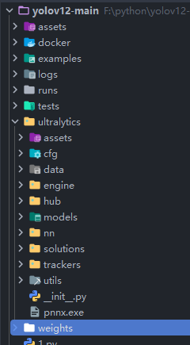
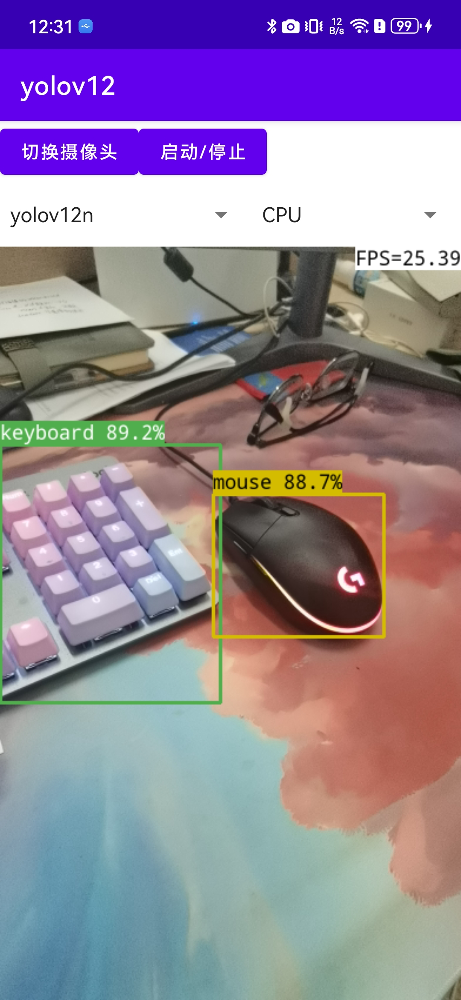
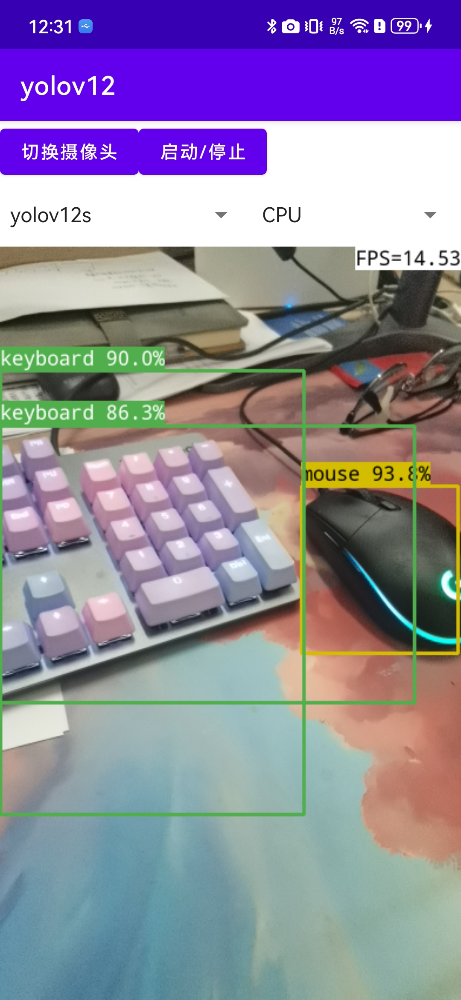
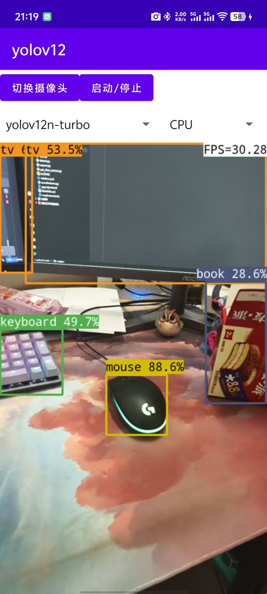
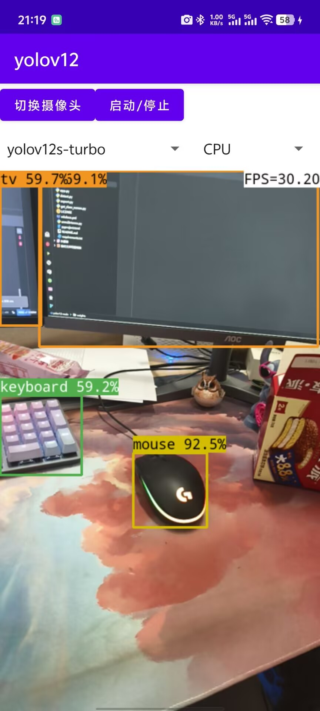

# ncnn-yolov12-android

Yolov12 model supports android deployment. Yolov8 and Yolov11 can also be supported.

## Please, have some stars for this repo. Thank you! 🌟🌟🌟🌟🌟

## Support the latest pnnx export

Download the latest pnnx and put it in the `ultralytics` directory.



```python
# -*- coding: UTF-8 -*-
"""
  @Author: mpj
  @Date  : 2025/2/20 18:44
  @version V1.0
"""
from ultralytics import YOLO

if __name__ == '__main__':
    model = YOLO("./weights/yolov12n.pt")
    model.export(**{
        'format': 'ncnn',
        'opset': 12,
        'simplify': True,
        'batch': 1,
        'imgsz': 320,  # This size should be consistent with the following code.
    })

```

file [
`native-lib.cpp`](https://github.com/mpj1234/ncnn-yolov12-android/blob/5f0981d8b289f97fae8dd02ba1107f56510f1330/app/src/main/cpp/native-lib.cpp#L175)

``` c++
const int target_sizes[] =
{
    320,
    320,
};
```

## Visualization result

<table>
  <tr>
    <td></td>
    <td></td>
    <td></td>
    <td></td>
  </tr>
</table>
