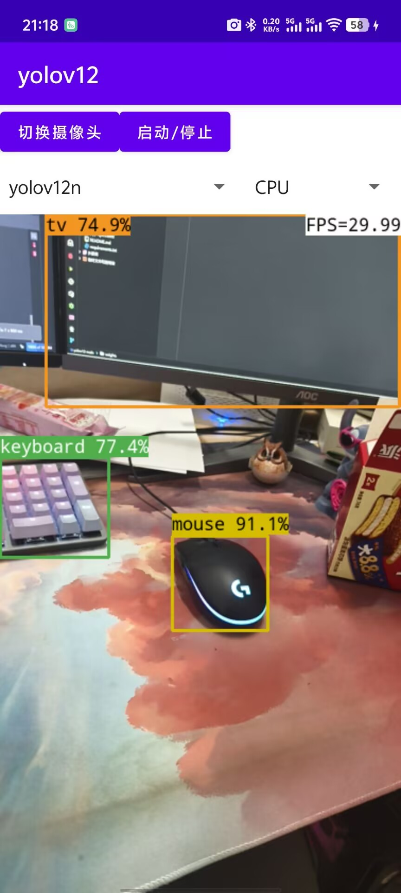

# ncnn-yolov12-android
Yolov12 model supports android deployment.

## Please, have some stars for this repo. Thank you! 🌟🌟🌟🌟🌟

## Support the latest pnnx export
```python
# -*- coding: UTF-8 -*-
"""
  @Author: mpj
  @Date  : 2025/2/20 18:44
  @version V1.0
"""
from ultralytics import YOLO

if __name__ == '__main__':
    model = YOLO("./weights/yolov12n.pt")
    model.export(**{
        'format': 'ncnn',
        'opset': 12,
        'simplify': True,
        'batch': 1,
        'imgsz': 320,
    })

```

## Visualization result


